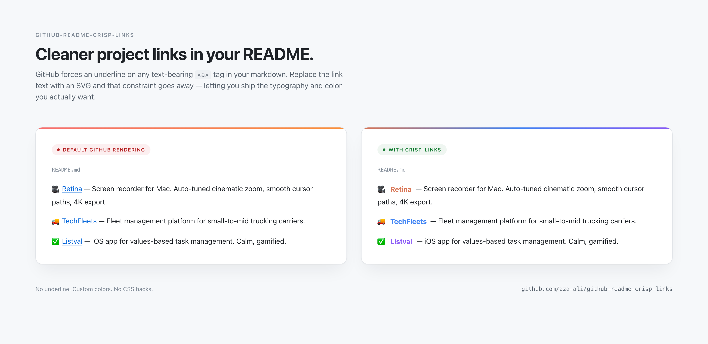

# github-readme-crisp-links

> Render link text as SVG so GitHub stops adding underlines to it.



GitHub's README CSS forces an underline on any `<a>` tag that contains text. That underline looks fine inline, but it makes project lists feel cluttered, especially when each entry already has an icon, a name, and a description. There's no markdown switch to turn it off. Inline `style=` is stripped. `<font>` is stripped. `text-decoration: none` is stripped.

What's *not* stripped: an `<a>` containing only `` elements. No text node, no underline. So if you render the project name as an SVG and drop the SVG inside the link, the underline goes away and the rest of the styling stays clean. You also get control of the color — pick whatever fits your project's brand instead of GitHub's default link blue.

This is a small Python CLI that does that for you. It measures the width of your project name against Helvetica Bold (so the SVG canvas fits the glyphs without clipping or padding), writes the SVG, and prints the markdown snippet ready to paste into your README.

## Install

```bash
git clone https://github.com/aza-ali/github-readme-crisp-links.git
cd github-readme-crisp-links
pip install -r requirements.txt
```

Pillow is the only dependency. Tested on Python 3.8+.

## Usage

One-off:

```bash
python3 crisp.py "Retina" --color D97757 --link https://blendpixel.com/products/retina
```

Output:

```
wrote retina.svg (59x22)
<a href="https://blendpixel.com/products/retina"></a>
```

The SVG is written to `retina.svg` and the snippet is printed to stdout. Paste the snippet into your README.

Multiple at once via a JSON batch file:

```bash
python3 crisp.py --batch projects.json
```

Where `projects.json` is an array of items, each item supporting any of: `name`, `color`, `output`, `link`, `font`, `font_size`, `font_weight`, `height`, `leading`, `trailing`. CLI flags act as defaults; per-item fields override. See `examples/projects.json`.

## Options

| Flag | Default | What it does |
|---|---|---|
| `name` | required | The text to render. |
| `--color` | `0969DA` | Hex color of the text. Accepts `RRGGBB` or `#RRGGBB`, 3 or 6 digit. |
| `--output` | `<slug>.svg` | SVG output path. Slugified from the name if not provided. |
| `--link` | none | Wrap the snippet in `<a href="...">`. |
| `--font` | auto-detect | Path to a TTF/OTF/TTC. Default tries Helvetica Bold, then DejaVu Sans Bold, then Arial Bold. |
| `--font-size` | `16` | Font size in px. |
| `--font-weight` | `600` | Font weight on the SVG `<text>`. |
| `--height` | `22` | SVG canvas height. The default leaves a few px of breathing room above and below the glyphs. |
| `--leading` | `6` | Left padding in px before the text starts. |
| `--trailing` | `4` | Right padding in px after the text ends. |
| `--batch` | none | JSON array of items. |
| `--quiet` | off | Suppress the stdout snippet. |

## Why other "fixes" don't work

If you go looking for ways to remove README link underlines, you'll find a lot of suggestions that quietly fail because GitHub's markdown sanitizer is strict. Things I tried before landing on the SVG trick:

- **Inline `style=` attributes.** Stripped on render. `<a href="..." style="text-decoration:none">name</a>` becomes `<a href="...">name</a>`.
- **`<font color="...">` tags.** Stripped completely.
- **A `<style>` block at the top of the README.** Stripped. GitHub allows almost no inline CSS.
- **HTML entities in the link text.** Doesn't matter, the underline applies to the `<a>` as a whole.
- **`<picture>` / `<source>` with `srcset`.** Works for theme-aware images but doesn't help with text underline.
- **Zero-width characters around the text.** Looks like cargo-cult magic and didn't change anything when I tested it.

The reason the SVG trick works: GitHub's primer CSS targets `.markdown-body a` and adds the underline. But the rule only paints text descendants. An `<a>` whose only descendant is an `` has no text to paint an underline under, so the link renders clean.

If the `<a>` contains *both* text and an image, you'll still get an underline under the text portion. That's why the snippet wraps a single `` only.

## Width measurement

The CLI uses Pillow's `ImageFont.getlength()` to measure how wide the rendered text will be. By default it loads Helvetica Bold from your system (TTC index 1 on macOS) and measures against that.

GitHub will display your SVG against the viewer's font stack at display time, which for most viewers is Helvetica or Arial. The two are close enough that the canvas fits without surprises. If you're using a long name or you notice clipping, bump `--trailing` by a few pixels.

If you'd rather calibrate against a different font (e.g., Inter Bold for parity with the rest of your site), pass `--font /path/to/Inter-Bold.ttf`. The CLI will measure against that font for sizing, but the SVG itself still renders against the system font stack — Pillow's job is just to give you an accurate width.

## Gotcha: GitHub camo caches your SVG aggressively

Once GitHub fetches your SVG through its image proxy, it caches the result hard. If you update the SVG and force-push, the README may keep showing the old version for hours.

Workarounds:

1. Add a cache-busting query parameter when you reference the SVG: ``. Bump the number when you update the file.
2. Rename the file. `retina.svg` → `retina2.svg`.

The cache-buster is what I use on my own profile.

## Gotcha: dark mode

A single SVG has a single fill color. If you want one color in light mode and another in dark mode, GitHub supports `<picture>` with `prefers-color-scheme`:

```html
<a href="https://example.com">
  <picture>
    <source media="(prefers-color-scheme: dark)" srcset="my-project-dark.svg" />
    
  </picture>
</a>
```

Generate two SVGs, one per theme, and reference both. This is also still text-free inside the `<a>`, so the underline still doesn't apply.

## License

MIT. See [LICENSE](LICENSE).
